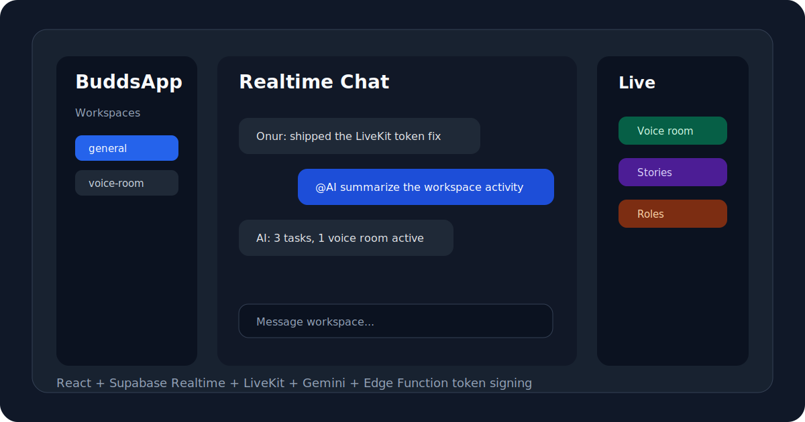

# BuddsApp

Real-time community chat platform with workspaces, voice rooms, stories, roles, file sharing, and an AI companion.



BuddsApp is a full-product React application built on Supabase, LiveKit, and Gemini. It is designed like a lightweight Discord-style workspace where users can join communities, chat in real time, share files, start voice calls, and interact with an AI assistant.

## Product Surface

- Workspace-based community structure
- Supabase Auth and member profiles
- Real-time chat through Supabase Realtime
- LiveKit-powered voice rooms
- Story-style media sharing
- Role-based controls for admins/moderators/members
- File sharing and document previews
- Gemini-backed AI companion behavior
- PWA-ready Vite build

## Architecture

| Area | Implementation |
| --- | --- |
| Frontend | React, Vite, custom CSS, Lucide icons |
| Auth and data | Supabase Auth, PostgreSQL, Realtime, Storage |
| Voice | LiveKit Cloud |
| AI | Gemini API stored through app settings |
| Server-side secret handling | Supabase Edge Functions |

## Security Note

LiveKit token signing is handled by `supabase/functions/livekit-token`. The LiveKit API secret is not used in browser code and should be configured only as a Supabase Edge Function secret.

## Environment

Frontend `.env`:

```env
VITE_SUPABASE_URL=your_supabase_project_url
VITE_SUPABASE_ANON_KEY=your_supabase_anon_key
VITE_LIVEKIT_URL=wss://your-project.livekit.cloud
VITE_ADMIN_EMAIL=admin@example.com
VITE_EASTER_EGG_PASS=your_secret_password
```

Supabase secrets:

```bash
supabase secrets set LIVEKIT_API_KEY=your_livekit_api_key
supabase secrets set LIVEKIT_API_SECRET=your_livekit_api_secret
```

## Local Development

```bash
npm install
npm run dev
```

## Validation

```bash
npm run lint
npm run build
```

`npm run lint` currently passes with warnings that are useful cleanup candidates.

## Recent Hardening

- Removed LiveKit API secret usage from browser code
- Added Supabase Edge Function token signing
- Removed generated build and scratch artifacts from source control
- Updated environment guidance to avoid leaking voice infrastructure secrets

## Roadmap

- Add screenshots or short demo video from a seeded workspace
- Split large chat-room logic into smaller modules
- Add focused integration tests for invite and voice-call flows
- Add deployment notes for Supabase/Vercel setup

## Author

Onur Acar - <https://github.com/onuracar-dev>
